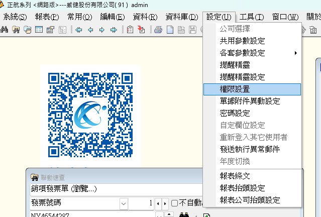
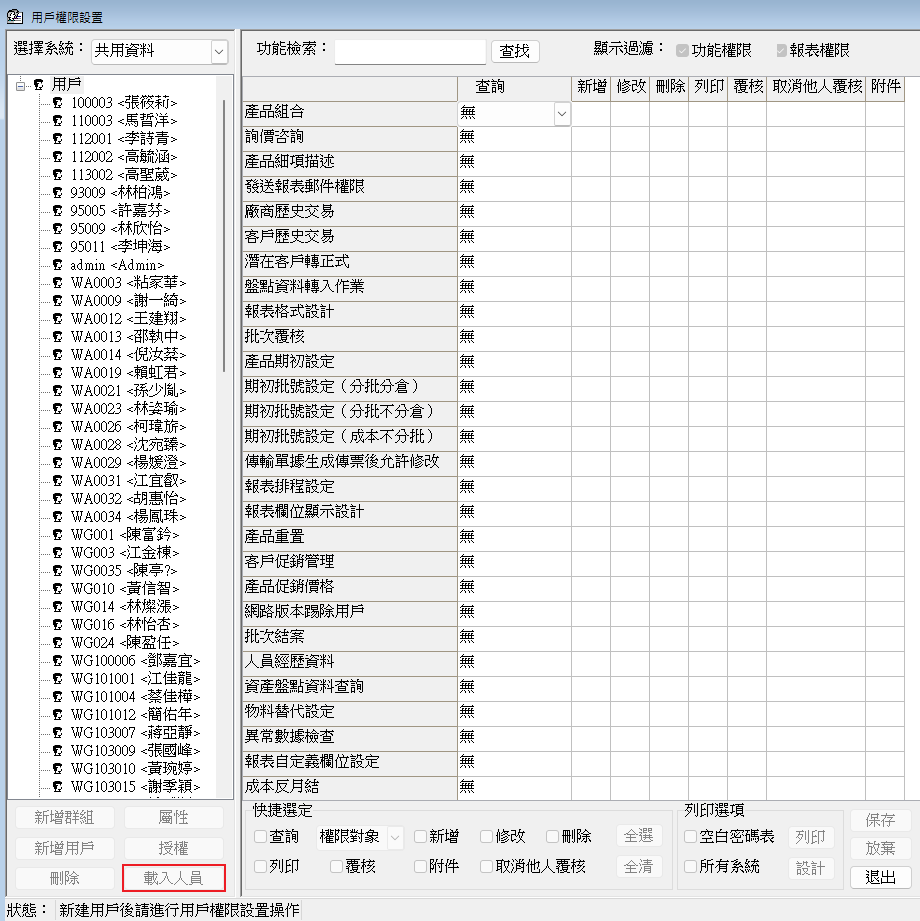
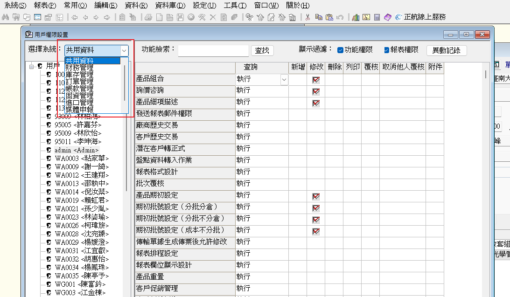

匯出機房進出紀錄SOP

Date: 7/1/2025

Author: Darson Lai

先確認好server 的卡機都有選好

{width="5.768055555555556in"
height="3.5972222222222223in"}

(參考"感應卡機設定及門組"裡面的設定看其他顯示範圍怎麼設定) ie:

{width="5.760415573053368in"
height="4.291666666666667in"}

TCP/IP 跟主動查詢要勾起來

{width="5.760415573053368in"
height="4.322916666666667in"}

{width="5.760415573053368in"
height="1.4479166666666667in"}{width="5.58333552055993in"
height="5.760415573053368in"}

{width="5.760415573053368in"
height="2.2708333333333335in"}{width="5.760415573053368in"
height="2.59375in"}
