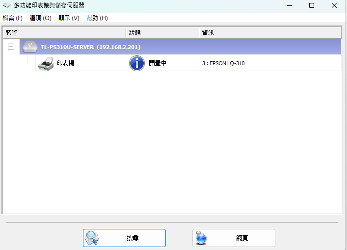

新人新設帳號SOP

Date: 2025/6/4

Revisions: 2025/8/7 增加正航設定事項

Author: Darson Lai

權限跟設定可以參照同部門同仁

nueIP記得需要代理人設定

**正行新帳號建立**

權限設置的部分加到相關群組即可，可是最後到其他公司綁定帳號的部分還是需要去設置

以下是如果沒有加群的手動設定

載入新建的帳號

參考同部門的權限設定

這裡不同的系統管理也需要看一下有沒有跟同部門的同步

屬性裡面也需要設定

確認能進可以進哪些公司(參考同部門)

權限設定裡面的分頁也記得查看

需要確定在其他公司也有綁定這個帳號讓他自由登入(先建立人員資料才能綁)

**新建nueIP帳號**

預設密碼先和帳號一樣，使用者下次登入可以更改

複製取代人或同部門的人員

**威健的門禁卡**

到PAN電腦執行

開啟701 server and client

先確認好server 的卡機都有選好

(參考”感應卡機設定及門組”裡面的設定)

以下在client操作 – 要下載到的卡機確認

(這是考勤的設定，門禁請參考”感應卡機設定及門組”裡面的設定，記得高雄或台中的門禁機要勾到!)

以下是卡片的設定

找空的”用戶位置”輸入卡ID。”不可通行”改成”讀取即可”。 

\*框框應該含有27，輸入在卡ID旁邊最左邊的格子

通行門組參照取代人或同部門的人員

考勤的設定雷同，會盡量用跟門禁一樣的”用戶位置”

再到nueIP將”用戶位置”輸入至”打卡卡號”注意需要六個數字 ie: 000001

**微傳的門禁卡**

微傳有預設過的園區卡，只需要設定701client卡號

如何撈卡ID:

先刷門禁機，門禁機顯示的是工號

再去日記查看你刷過的時段應該有紅字顯示無效卡

詳加說明顯示的就是卡ID，再輸入至701client即可

*門禁卡設定完記得紀錄至【門禁卡位址】*

NueIP 需要綁定手機才能線上打卡

[PowerPoint
簡報](https://file.nueip.com/user_manual/tc/208_Mobile_GPS_positioning_settings_manual.pdf)

**設定微傳卡連同nueIP打卡考勤**

微傳讀卡機會顯示”工號”

用工號來找”用戶位址”輸入nueIP員工的打卡卡號

**建立連線至微傳內網VPN**

用watchGuard
Firebox軟體先連線至微傳內網後再到211.23.180.61:8080微傳防火牆建立新的VPN帳密
