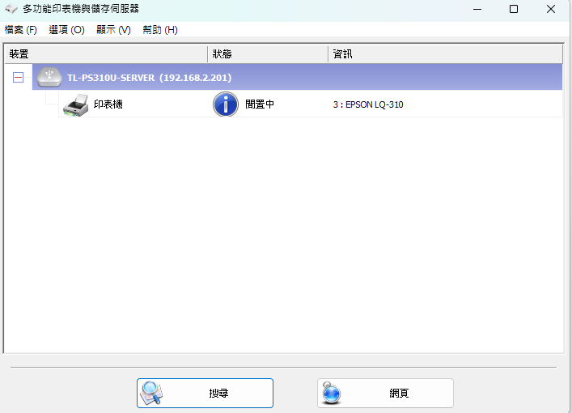

裁員/離職人員 SOP

Date: 2025/6/26

Revisions: 2025/8/28 增加ERP, email處理事項

Author: Darson Lai

全部人員在離開之前需要確保公司電腦的密碼有解除

nueIP: 需要掛離職狀態(要注意離職日期)

Email 信箱 由申請單指示操作

如果可以停用，收信跟寄信功能可以先關掉，確認好已沒有裝置在使用此email登入後再進行停用登入(怕重複登入失敗導致IP被serverzoo擋起來)

如果有轉寄的需求就到cpanel的轉寄站去做設定

正航的話需要設定禁用

**裁IT人員SOP:**

*主管告知的前一天*

刪除 SSL VPN 帳號

移除重要文件權限

- [例行事項.xlsx](https://1drv.ms/x/c/5379f79f105bfd34/ESaF3A-6ZCBPqInLd3fb8BkBC3iVhLDTF-V5TrN8uda5Tw?e=9kjTRD)

- [系統及軟體.xlsx](https://1drv.ms/x/c/5379f79f105bfd34/EUlMd9cMX_5Omb9R8OKmikQBKSfJyv_EEaBqDaV88jvxWQ?e=IdvKIs)

*主管告知當天*

禁止使用電腦(只允許刪除或登出個資相關資訊)

機房進出權限

Email權限

**業務人員:**

有一些會用個人電腦安裝公司的office，離職的時候需要確認有登出

目前確定有在私人電腦使用公司帳號的office有:

宋志屏 \*367 0922-418616 0963-700891 <Allensong@welgene.com.tw>

盧翼涵 \*248 <yihan_lu@welgene.com.tw>
