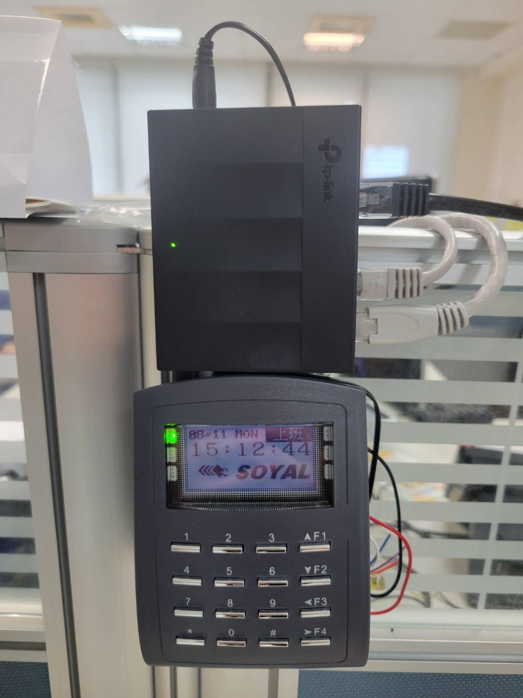
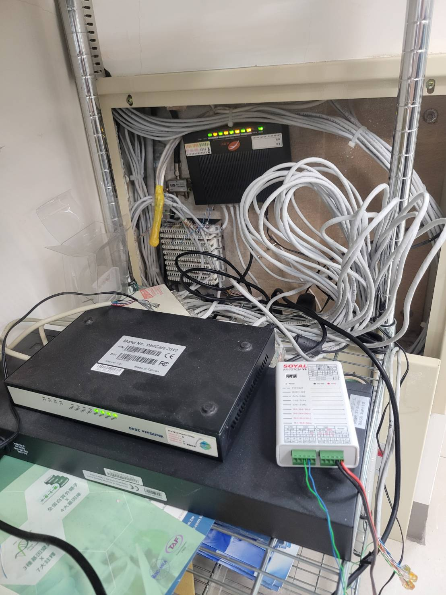
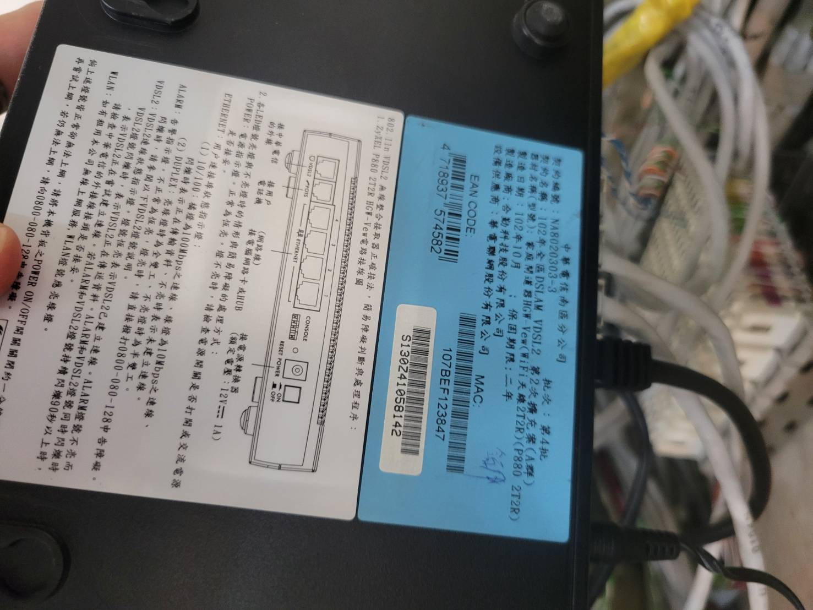

高雄威建門禁機無法連線 (701server顯示紅色叉叉狀態)

Date: 2025/8/12

Author: Darson

先確認了router有設相關NAT設定

門禁可以登入頁面 (192.168.0.127)可以看到有連到台北的IP

這時候有請高雄的同仁幫我們重啟兩台機器:

1.  門禁機

2.  Soyal米白色這台連結到門禁機的機器

重啟後過一陣子看連線狀態就好了

